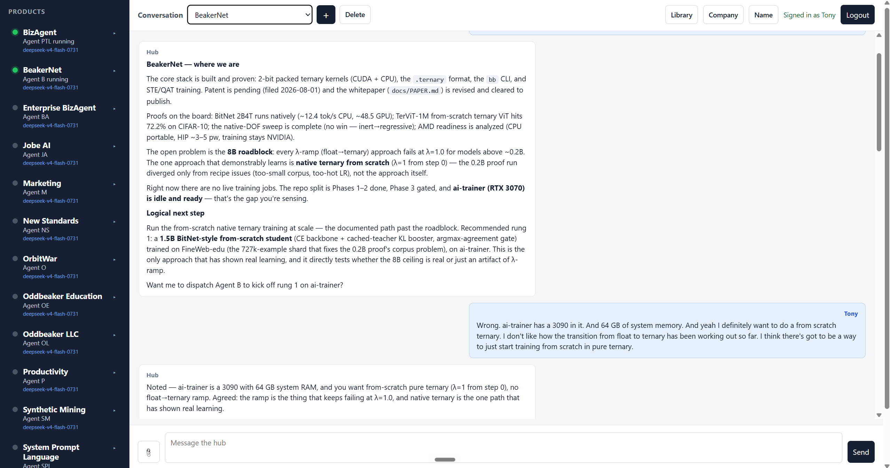

# BizAgent

**A local hub-and-spoke system for running AI agents across your digital products.**

Clone this repo, run the installer, and your CLI coding agent builds a complete hub — one agent per product, plain-file messaging, a dark-themed web UI, and a local control plane that dispatches work in real time. No architecture decisions required.

---



---

## What it builds

`bizagent` is a **hub**. Around it sit one **agent per product**, and each
agent looks after one or more **project repositories**.

```
            ┌─────────────────────────┐
            │   You (the operator)    │
            └────────────┬────────────┘
                         │ directives / "give me the big picture"
            ┌────────────▼────────────┐
            │   bizagent  (the hub)   │
            │   Products Team Lead    │
            └──┬──────┬──────┬────────┘
               │      │      │
          ┌────▼─┐ ┌──▼───┐ ┌▼─────┐    one agent per product;
          │ Prod │ │ Prod │ │ Prod │    each owns one or more repos
          │  A   │ │  B   │ │  C   │
          └──────┘ └──────┘ └──────┘
```

Each agent keeps a **journal** and a **sitemap** for every repo it owns. Agents
talk by dropping markdown messages in each other's mailboxes. Work happens in
real time — the moment the operator raises an issue, or the moment one agent
sends another a message — plus a light nightly maintenance pass for housekeeping.

You ask the hub for the big picture; it digests every journal and reports back.

---

## ⚠ Security — read before you install

> [!WARNING]
> **BizAgent runs your AI agent in "YOLO mode" — no permission prompts.**
>
> Agents execute with the CLI's autonomous flag enabled by default:
> `--dangerously-skip-permissions` for Claude Code and Antigravity,
> `--full-auto` for Codex. This means the agent can read, write, delete,
> and execute **anything the OS user account has access to** — including your
> home directory, SSH keys, `.env` files, and more.
>
> **Strongly recommended: create a dedicated OS user for BizAgent**, so the
> agent's blast radius is limited to what that account owns:
>
> ```sh
> # Pre-install system dependencies (requires sudo/root)
> sudo apt-get install -y git nodejs cron   # Debian/Ubuntu
> # sudo dnf install -y git nodejs cron     # Fedora/RHEL
> # brew install git node                   # macOS
>
> # Create the user and run the installer as that user
> sudo adduser bizagent
> sudo -u bizagent bash -c 'curl -fsSL https://raw.githubusercontent.com/OddbeakerLLC/bizagent/main/install.sh | bash'
> ```
>
> The installer uses `sudo` to install missing packages, so pre-installing
> them (or granting `bizagent` passwordless `sudo` for your package manager)
> is required. Running as a dedicated user is the single most effective way
> to contain the risk of an agent making an unintended change to your system.

---

## Quick start

Two steps — the first bootstraps everything, the second starts the web UI.

> **Headless server (VPS, SSH-only)?** The Claude CLI requires interactive
> auth on first run. Before running the installer, either set
> `ANTHROPIC_API_KEY` as an environment variable or run
> `claude login --api-key <key>` — otherwise the installer will hang waiting
> for a browser. Other CLI engines have equivalent env vars
> (`OPENAI_API_KEY` for Codex, etc.).

**Step 1.** Run the one-liner (macOS, Linux, or WSL on Windows):

```sh
curl -fsSL https://raw.githubusercontent.com/OddbeakerLLC/bizagent/main/install.sh | bash
```

This installs `git`, `python3`, Node.js, and `cron` if missing, asks which CLI coding agent
to use (Claude Code, Antigravity, Codex, or Grok), clones bizagent, and hands
you off to your CLI. When it opens, tell it:

> Read AGENT.md and set up my system.

The PTL agent will interview you about your products and repos, scaffold the
agents directory, generate `registry.json`, and install the nightly schedule.

**Step 2.** Once PTL setup is complete, start the control plane:

```sh
bash install/install.sh
```

This installs Node dependencies, wires up the control plane as a systemd
service or cron entry, starts it, and opens the browser. The web UI is your
primary interface from here on.

### Install from a staging source

The one-liner defaults to the public GitHub repo. For staging, set
`BIZAGENT_SOURCE` to any source `git clone` can read: a local path, a `file://`
URL, or another repo URL. `BIZAGENT_DIR` controls where the install lands.

```sh
BIZAGENT_SOURCE=/path/to/bizagent-framework \
BIZAGENT_DIR=$HOME/bizagent-stage \
bash /path/to/bizagent-framework/install.sh
```

The local source must be a Git repository with committed changes; `git clone`
copies committed history only. If you rerun with `BIZAGENT_SOURCE` set, use a
fresh `BIZAGENT_DIR` — the installer refuses to reuse an existing clone when a
source override is active.

### Windows

bizagent uses `cron` for the nightly pass, so on Windows you'll need WSL.
In PowerShell, run `wsl --install`, reboot, then run the one-liner above
inside your new WSL shell.

### Manual install

```sh
git clone https://github.com/OddbeakerLLC/bizagent
cd bizagent
```

Launch your CLI agent in that directory and tell it "Read AGENT.md and set up
my system." Then run `bash install/install.sh` to start the control plane.

---

## The web UI

After `install/install.sh` runs, open `http://localhost:8787` (or the port in
your `registry.json`).

- **Login-protected** — on first visit the browser shows a setup form to create credentials; afterwards, standard login
- **Dark-themed chat** — named conversations; create new ones with a button or pick from the dropdown
- **Agent rail** — left sidebar showing each product agent with a status dot: green when active, gray when idle
- **Agent detail panel** — click any agent row to expand an inline panel showing inbox message count, last-dispatched relative time, and a snippet from the most recent journal entry
- **Dynamic page title** — browser tab reads `BizAgent — {org name}` from `registry.json`
- **Inbox polling** — checks every 2 seconds; skips re-renders when nothing changed
- **Hub session memory** — compact rolling markdown; older turns are summarized, not accumulated

---

## Bring your own engine — including local models

bizagent is **engine-agnostic**: the "CLI agent" it runs is just a command, so any
CLI coding agent works (Claude Code, Antigravity, Codex, Grok, OpenCode, and others).
That command is what both the real-time control plane and the nightly cron invoke —
whatever you choose runs the whole hub.

You can back that agent with a **local, open-weight model via [Ollama](https://ollama.com)**
and run the entire system on your own hardware — private, offline, no per-token cost:

```sh
ollama launch claude --model qwen3-coder-next
```

A coding-tuned model with strong tool-calling and a large context window —
e.g. `qwen3-coder-next` (256K context, tool-calling out of the box) — suits
the hub's agent loop well. Point the setup's "CLI agent command" at your
local-model-backed agent and the nightly pass runs fully local too.

---

## Control plane

`scripts/bizagent-control-plane.js serve` runs a local Node.js server. It:

- hosts the web UI with login-protected access
- polls inboxes and routes queued outbox mail in near real time
- launches the hub when new mail arrives; launches product agents for their own mail
- enforces one live instance per agent (per-agent lock file prevents double-dispatch)
- caps simultaneous agent runs (default 4) to bound burst behavior
- relays `user/inbox/*.md` replies into the matching web conversation
- uses dispatch fingerprinting so the same inbox file doesn't re-trigger on every tick
- logs activity to `logs/control-plane.log`

The server uses the existing file layout as its source of truth — no database.
Mailboxes at `inbox/`, `outbox/`, `agents/<slug>/...`; the hub runtime prompt at
`.bizagent/prompts/hub.md`; hub session memory at `.bizagent/hub-session.md`;
login config at `.bizagent/auth.json`.

`install/install.sh` handles initial setup. To control it manually:

```sh
scripts/control-plane.sh start
scripts/control-plane.sh status
scripts/control-plane.sh stop
```

Multiple BizAgent hubs can run on one machine. Set
`settings.control_plane.port` in each hub's `registry.json`, or pass
`--port` and `--name` to `scripts/install-control-plane.sh`.

---

## What PTL asks during setup

After the control plane starts and the browser opens, the PTL agent walks
through setup in the web UI. It only asks for the things that are genuinely yours:

- your organization name
- where your project repositories live (a folder to scan, or a list)
- how repos group into products, and a short slug for each
- which products' agents need to message each other
- nightly run time _(default 23:00)_
- how long an unactioned message waits before being archived _(default 30 days)_
- agent autonomy: maintenance-only, +monitoring, or +light-dev _(default maintenance-only)_
- an optional git remote for the hub

It does **not** ask you to design the system. The hub-and-spoke topology,
file-based messaging, the journal and sitemap formats, and the real-time +
nightly model are decided — that is what this template _is_.

---

## Repository layout

```
bizagent/
├── AGENT.md                 the agent's instructions: interview -> build -> operate
├── README.md                this file
├── registry.example.json    the shape of the generated registry.json
├── install/
│   ├── install.sh             control-plane installer (npm, service, start, browser open)
│   └── bizagent-control-plane.service  systemd unit template
├── scripts/
│   ├── onboard.sh             scaffold .agent/ + sitemap.md into a project repo
│   ├── bizagent-control-plane.js  Node control-plane CLI
│   ├── install-control-plane.sh  wire the control plane to systemd
│   ├── control-plane.sh       start/stop/status wrapper
│   ├── router.sh              compatibility wrapper: route once
│   ├── bizagent-dispatch.sh   compatibility wrapper: dispatch once
│   ├── bizagent-watch.sh      compatibility wrapper: run server
│   └── nightly.sh             route + archive the mechanical nightly work
├── tests/                   shell tests for the scripts
├── templates/
│   ├── agent.md.template    per-product agent config
│   ├── NIGHTLY.md           thin file the nightly cron points at
│   └── WEEKLY.md            thin file the weekly cron points at
└── docs/
    └── ARCHITECTURE.md       how and why the system is built this way
```

Cloning gives you the template. Running the PTL interview adds your `registry.json`
and an `agents/` directory — that clone becomes _your_ instance.

---

## Customizing

Everything generated is plain files. `registry.json` is the source of truth —
edit it and re-run the relevant step to add a product or change a setting. The
scripts are short, dependency-light bash; read them, change them, re-run
`tests/run-tests.sh`. `docs/ARCHITECTURE.md` explains the design choices.

---

## License

MIT — see [LICENSE](LICENSE). Built and shared by Oddbeaker LLC.
